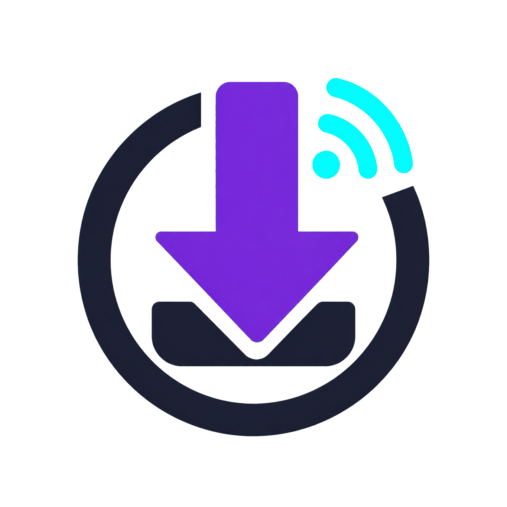
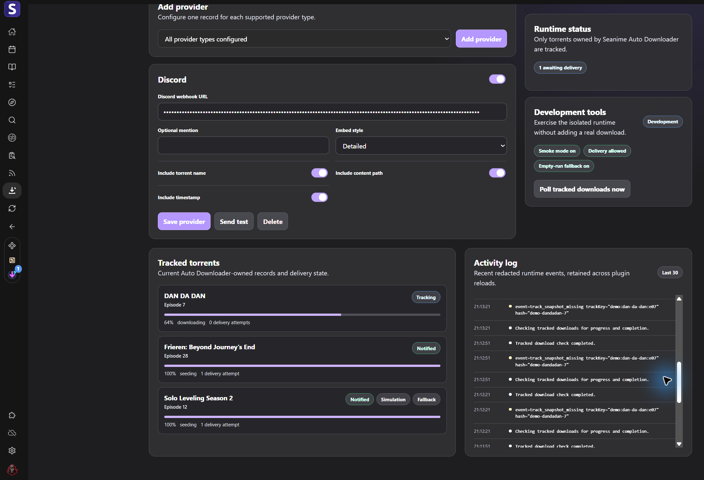

# Seanime Download Notifier

<p align="center">
  
</p>

<p align="center"><strong>Completion notifications for torrents started by Seanime's Auto Downloader.</strong></p>

Seanime Download Notifier remembers torrents queued by [Seanime](https://seanime.app/), waits until the configured torrent client reports completion, then sends a notification. Discord webhooks are supported today. The provider system is designed so additional provider types can be added without redesigning the tracker or its UI.

> [!IMPORTANT]
> The plugin tracks only torrents added through Seanime's Auto Downloader hook. Manually added torrents are intentionally ignored.



The development dashboard keeps provider setup, live Auto Downloader tracking, delivery state, and a redacted activity trail visible in one place. Development-only controls are omitted from production builds.

## What it does

- Tracks Auto Downloader torrents by normalized info hash.
- Polls only while tracked downloads are pending and considers `progress >= 1` complete.
- Retries failed deliveries and marks a download notified only after every enabled provider succeeds.
- Persists tracking, retry, retention, and de-duplication state across restarts.
- Enriches Discord embeds with anime and episode artwork, episode metadata, rating, release quality, codecs, size, languages, and release group when available.
- Keeps provider configuration in plugin storage instead of crowding Seanime's generated Preferences page.
- Shows current tracked-torrent delivery state and a bounded, redacted in-memory activity log in the plugin page.
- Provides separate production and development bundles, plus a browser-based Mock Seanime test bench.

## Install

Add the hosted release manifest URL to Seanime's extension manager:

```text
https://github.com/Hyperclaw79/seanime-download-notifier/releases/download/v1.0.0/seanime-download-notifier.json
```

Open **Download Notifier** from Seanime's plugin sidebar, choose a provider type, and select **Add provider**. For Discord, paste a webhook URL, choose the embed options, enable the provider in the card header, save it, and use **Send test** to verify delivery.

Global behavior such as polling interval and retention remains in Seanime's generated Preferences page. Provider-specific fields are owned by each provider and rendered in the plugin page. Provider records are stored under `download-notifier-provider-config-v1`; torrent state is stored under `download-notifier-state-v1`.

## Discord notifications

Detailed embeds can include:

- anime title, format, year, runtime, score, and genres;
- episode number, title, cover art, and episode artwork;
- inferred quality, source, video/audio codec, languages, size, and release group;
- a cleaned, truncated torrent title and, when explicitly enabled, its content path.

Metadata is best-effort. A missing anime image or an unfamiliar torrent naming scheme never prevents the completion notification itself.

## How tracking works

`onAutoDownloaderAfterDownloadTorrent` means a torrent was queued; it is not a completion event. The isolated hook records Seanime ownership, then signals the UI runtime through `$store`. The UI runtime persists the record with `$storage` and polls `ctx.torrentClient.getTorrents()` for matching hashes. Completed records are delivered through all enabled provider records and retained for the configured period to prevent duplicates after restart.

Each track has its own identity token. A stale poll or a development simulation cannot update a newer record that happens to use the same torrent hash.

## Development

### Requirements

- Node.js 20 or newer
- npm
- Seanime/Denshi for live runtime validation
- Chromium for Playwright (`npx playwright install chromium`)

```powershell
npm install
npm --prefix mock-seanime install
npm run lint
npm run typecheck
npm test
npm run test:e2e
npm run build
```

Run the visual test bench with `npm run mock:dev`. The normal Mock page mirrors the actual plugin webview, including tracked torrents and recent activity. `?harness=1` adds Mock-only mutation controls used by Playwright to exercise tracking and delivery without contacting a torrent client or Discord.

### Load the development plugin

```powershell
npm run build:plugin
npm run manifest:dev
Copy-Item .\seanime-download-notifier-dev.json "$env:APPDATA\Seanime\extensions\seanime-download-notifier-dev.json" -Force
```

The destination filename must exactly match the development extension ID for **Reload Plugin** to work. `seanime-download-notifier-dev.json` is generated and machine-local; `seanime-download-notifier-dev.example.json` is the committed template.

The development manifest exposes three safeguards for native Auto Downloader simulation:

1. **Development simulation smoke mode**
2. **Allow development simulation notifications**
3. **Use completed torrent fallback when native simulation finds no candidates**

**Simulation completion delay** controls how long the development track remains visibly in progress before its completion snapshot is delivered (three seconds by default).

The optional fallback uses an existing completed torrent only as a completion snapshot. It creates a separate temporary smoke track, never overwrites a real track, and sends through the normal provider pipeline. The feature is compiled out of production builds.

### Add a provider type

Provider-specific config and transport belong to the provider, not the UI runtime.

1. Add the provider ID, stored config type, field schema, normalization, defaults, readiness check, and transport adapter under `src/providers/`.
2. Keep the isolated adapter factory self-contained. Denshi recreates it in isolated runtimes through `$shared`.
3. Register the factory in `src/plugin.ts` with a stable `$shared.define(...)` key and include it in the shared provider catalog. The generic UI runtime consumes that catalog; it must not name the provider directly.
4. Add the provider's network domains to the manifest permissions only when required.
5. Add unit tests for normalization and payload delivery, an isolation regression in `test/unit/plugin-entrypoint.test.ts`, and Mock/E2E coverage for its generated fields.

The UI builds provider cards from each adapter's field definitions. Do not hard-code a provider's fields, validation, payload builder, or endpoint into `ui-runtime.ts`, and do not add provider settings to root manifest preferences.

## Project structure

```text
seanime-download-notifier/
|-- assets/
|   |-- logo.png
|   `-- screenshots/               Current plugin UI captures
|-- mock-seanime/
|   |-- src/                       Mock plugin page and local runtime
|   `-- tests/                     Playwright UI and lifecycle tests
|-- scripts/
|   |-- build-plugin.ts
|   |-- generate-dev-manifest.ts
|   |-- generate-release-manifest.ts
|   |-- manifest-shared.ts         Shared manifest source of truth
|   |-- prepare-repository-wiki.mjs
|   `-- validate-manifest.ts
|-- src/
|   |-- core/                      Tracking, completion, retention, scheduler
|   |-- providers/                 Provider contracts, schemas, and transports
|   |-- seanime/
|   |   `-- isolated/              Self-contained Denshi callback adapters
|   `-- plugin.ts                  Small registration entrypoint
|-- test/
|   |-- integration/
|   `-- unit/
`-- seanime-download-notifier-dev.example.json
```

## Runtime isolation rules

Seanime evaluates `$ui.register(...)` and plugin hook callbacks in isolated JavaScript runtimes. A registered callback cannot safely reference imported helpers, module-scope constants, or outer closure state after bundling. Keep callback dependencies inside the callback body, communicate between hook and UI runtimes with `$store`, and persist durable state with `$storage`. Regression tests inspect the built callback bodies to enforce this boundary.

## Commands

| Command                       | Purpose                                                    |
| ----------------------------- | ---------------------------------------------------------- |
| `npm run lint`              | Lint source, tests, scripts, and Mock React code           |
| `npm run typecheck`         | Type-check plugin source and tooling                       |
| `npm test`                  | Run Vitest unit and integration tests                      |
| `npm run test:coverage`     | Run Vitest with coverage thresholds                        |
| `npm run test:e2e`          | Run Playwright against Mock Seanime                        |
| `npm run build:plugin`      | Build production and development plugin bundles            |
| `npm run mock:build`        | Type-check and build the Mock UI                           |
| `npm run manifest:dev`      | Generate the machine-local development manifest            |
| `npm run manifest:validate` | Validate manifest templates and generated manifests        |
| `npm run docs`              | Generate TypeDoc API documentation in `docs/api`          |
| `npm run docs:wiki`         | Prepare the Markdown handbook for repository Wiki publishing |
| `npm run build`             | Run lint, typecheck, builds, docs, and manifest validation |

## Release manifests

The release manifest is the stable Seanime install and update endpoint. It is generated during CI and published beside the versioned plugin bundle; generated JavaScript and generated manifests are not committed. Regenerate a local release manifest for inspection with the intended raw and release hosts:

```powershell
npm run manifest:release -- --base-url=https://raw.githubusercontent.com/Hyperclaw79/seanime-download-notifier/main --manifest-url=https://github.com/Hyperclaw79/seanime-download-notifier/releases/download/v1.0.0/seanime-download-notifier.json --payload-url=https://github.com/Hyperclaw79/seanime-download-notifier/releases/download/v1.0.0/plugin.js
```

GitHub Actions run linting, type checking, coverage, builds, manifest validation, TypeDoc generation, and Mock UI E2E for public branches and pull requests. Pushing a matching `vMAJOR.MINOR.PATCH` tag on GitHub publishes `plugin.js`, the generated manifest, checksums, and a Markdown documentation archive to the GitHub release. The tag is rejected when it differs from `package.json`.

The maintainer Forgejo workflows use the same generated-manifest model for the maintainer-hosted release path. They are intentionally separate from the public GitHub workflows so private hosting details stay out of the public install instructions.

Seanime loads extension icons as external browser images. The raw host serving `assets/logo.png` must send CORS headers; GitHub raw does this by default, but a private Forgejo host may need CORS enabled for raw asset responses.

Before publishing, verify the manifest and payload URLs, install the release manifest in a clean Seanime instance, complete one controlled Auto Downloader download, and restart Seanime to confirm that delivery is not duplicated.

## Contributing

Issues and pull requests are welcome. Keep changes provider-neutral outside `src/providers/`, preserve the isolated callback boundary, and add regression coverage for retry, de-duplication, and concurrent-track behavior when relevant.

Before opening a pull request, run `npm run lint`, `npm run typecheck`, `npm test`, and `npm run test:e2e`. Also run `npm run manifest:validate` for manifest changes and `npm run docs` for public API changes. Never commit webhook URLs, generated manifests, or local absolute paths.

## License

[MIT](LICENSE)
